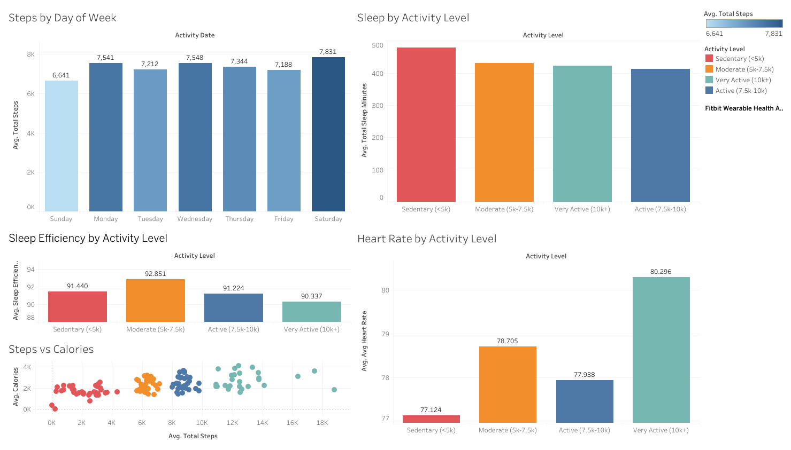

# Wearable Health Analyzer

End-to-end health analytics pipeline analyzing Fitbit wearable data from 35 users over 2 months.

## Dashboard

[View Live on Tableau Public]
(https://public.tableau.com/app/profile/luis.millan6098/viz/FitbitWearableHealthAnalyticsDashboard/Dashboard1)

## Stack
PySpark · PostgreSQL · Tableau · Python

## Key Findings
- Users average 7,280 steps/day — below the 10,000 step benchmark — with Saturday being the most active day and Sunday the least
- Sedentary users sleep 60+ more minutes per night than active users, but with significantly more restless sleep
- PySpark aggregated 3.6M second-level heart rate readings into daily summaries, enabling population-level cardiovascular analysis

## Data Source
[Fitbit Fitness Tracker Data](https://www.kaggle.com/datasets/arashnic/fitbit) — Kaggle

